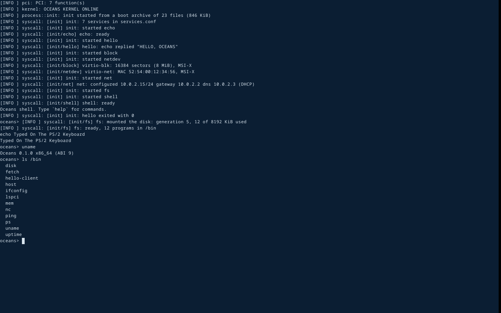

# ADR-0029: Framebuffer console and PS/2 keyboard

- Status: Accepted
- Date: 2026-10-03
- Depends on: ADR-0017 (console), ADR-0009 (MMIO mappings)
- Adds dependency: `noto-sans-mono-bitmap` 0.3 (MIT)

## Context

Oceans was usable only over a serial line. A machine with a screen and a
keyboard, which includes the QEMU window from `cargo xtask run`, showed
nothing and accepted nothing. The full graphical experience (SvelteKit
UI) is a later phase. A text console on the boot framebuffer makes the
system usable on a screen now, and stays as the fallback and diagnostic
view.

## Decision

### Display (`kernel/src/display.rs`)

- Limine provides the framebuffer. The kernel maps it uncached and draws
  text when it is 32-bit RGB; otherwise the display stays off and serial
  carries on. Diagnostics never depend on the display (master spec §42).
- **Font:** Noto Sans Mono, 16 px, regular, anti-aliased (pre-rasterized
  by `noto-sans-mono-bitmap`, `no_std`, no allocation, MIT). Only Basic
  Latin is compiled in. Hand-written glyph tables would be error-prone;
  this crate is small and does one thing.
- **What is shown:**
  - console output (the shell and programs);
  - kernel log lines at Info and above. Debug lines stay on serial so the
    screen stays readable.
  - The same lock serialises both, so they never interleave within a
    write.
- **Terminal subset:**
  - CR, LF, backspace and tab;
  - `ESC [ 2 J` (clear), `ESC [ row ; col H` (cursor), `ESC [ K` (clear
    line); other escape sequences are consumed silently.
  - An inverted block cursor.
- **Scrolling** moves a quarter of the screen at a time. Moving the
  pixels of an uncached framebuffer is the expensive part, and doing it a
  quarter screen at a time makes long output cheap.
- **Panic paths** use `try_write` and never wait on the display lock.

### Keyboard (`kernel/src/arch/x86_64/keyboard.rs`)

- The PS/2 controller (i8042) is set up for IRQ 1, keeping scancode set 1
  translation. The interrupt is routed through the I/O APIC like COM1.
  The I/O APIC setup is now shared.
- Make codes are mapped to ASCII, with Shift, Caps Lock and Ctrl
  (Ctrl+letter gives control bytes, e.g. Ctrl+C = 0x03). Enter sends CR
  and Backspace sends DEL, like a serial terminal.
- **Key presses feed the same console input ring as the serial line**, so
  the shell and programs need no change.
- Without a controller the kernel logs it and continues.

## Consequences

- `cargo xtask run` gives a working QEMU window: the boot log, then the
  shell, typed into directly.
- Not yet: arrow keys or editing keys, colours (escape codes are
  ignored), USB keyboards (xHCI, Phase 4), a userspace display service,
  and write-combining for faster drawing on real hardware.
- The kernel draws text. A graphical display will move to a userspace
  compositor, holding the framebuffer as a capability.

## Testing

- **Smoke** (all variants: debug, release, `-cpu max`): the kernel finds
  the 1280×800 framebuffer (182×50 text) and the PS/2 keyboard, and every
  boot step runs with the display mirroring output.
- **By hand,** with QEMU's monitor driving it headless:
  - typing `echo Typed On The PS/2 Keyboard` with key events (Shift for
    capitals), then `uname` and `ls /bin`;
  - the shell received the typed text and ran the commands;
  - a screendump of the framebuffer shows the log, scrolled output, the
    typed commands and their output, and the cursor:

  
